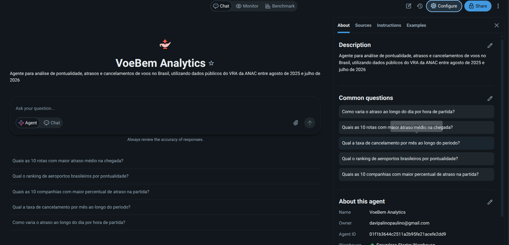
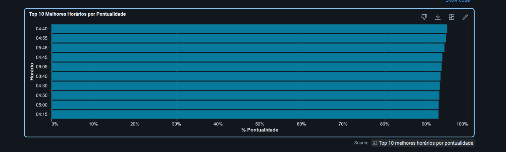

# ✈️ voebem | Pipeline de Dados de Aviação Civil

> **Imersão Alura + Databricks | Arquitetura Medalhão completa**

Pipeline de Engenharia de Dados desenvolvido com **Databricks**, **Apache Spark**, **Delta Lake** e **Unity Catalog**, transformando dados públicos da **ANAC** em uma plataforma analítica governada e preparada para consumo por **BI e Agentes de IA**.

```text
┌─────────────┐      ┌─────────────┐      ┌─────────────┐
│   🥉 BRONZE  │ ───▶ │   🥈 SILVER  │ ───▶ │   🥇 GOLD    │
│   Landing   │      │  Validação  │      │  Analytics  │
└─────────────┘      └─────────────┘      └─────────────┘
     CSV                Delta Lake           Star Schema
  1.014.882           1.014.841 voos         985.524 voos
   registros          (41 duplicatas)       255 aeroportos
```

---

## 📊 Números do Projeto

| Métrica | Valor |
|---------|-------|
| 🗂️ **Tabelas criadas** | 11 (4 Bronze + 4 Silver + 3 Gold) |
| 📝 **Colunas documentadas** | 129 COMMENTs aplicados |
| 🏷️ **Tags de governança** | 38 tags (camada, domínio, consumo) |
| ✅ **Dados validados** | 985.524 voos (97,1% qualidade) |
| 🚨 **Quarentena** | 29.317 registros (2,9%) |
| 📈 **Cobertura de lineage** | 100% (Bronze → Silver → Gold) |
| 🤖 **Agente Genie** | 1 Space configurado (5 Starter Questions + 4 SQL Examples) |

---

# 🏗️ Arquitetura

## 🥉 Bronze — Ingestão

Camada responsável pela ingestão dos dados brutos provenientes da ANAC.

```text
CSV files (ANAC)
  ├─ vra.csv (1.014.882 linhas)         → bronze.vra
  ├─ empresas_aereas.csv (189 empresas) → bronze.empresas_aereas
  ├─ aerodromos.csv (278 aeroportos)    → bronze.aerodromos
  └─ codigos.csv (seed table)           → bronze.codigos_operacao
```

---

## 🥈 Silver — Qualidade + Tipagem

A camada Silver aplica regras de qualidade, validação, tipagem e tratamento dos dados.

### Pipeline de Qualidade

```text
Pipeline de Qualidade
  │
  ├─ 01_vra-marcados.sql
  │     └─ Marca problemas
  │        ├─ atraso fora de faixa
  │        └─ ICAO inválido
  │
  ├─ 02_vra_auditados.sql
  │     └─ Aprovação dos registros
  │        ├─ 985.524 aprovados
  │        └─ 29.317 em quarentena
  │
  └─ 03_vra_quarentena.sql
        └─ Isolamento dos dados suspeitos
```

### Tabelas Governadas

```text
silver.vra
  └─ 26 colunas
     └─ Métricas de atraso validadas

silver.empresas
  └─ 11 colunas
     └─ Cadastro unificado

silver.aerodromos
  └─ 13 colunas
     └─ Latitude, longitude e classificação

silver.codigos_operacao
  └─ 4 colunas
     └─ Dicionário de códigos DI
```

---

# 🥇 Gold — Analytics

A camada Gold disponibiliza os dados preparados para consumo analítico, BI e Inteligência Artificial.

## Modelo Estrela

```text
                    ┌─────────────────────┐
                    │  gold.dim_aeroporto │
                    │     255 registros   │
                    └──────────┬──────────┘
                               │
                               ▼
                    ┌─────────────────────┐
                    │   gold.fato_voos    │
                    │    985.524 voos     │
                    └──────────┬──────────┘
                               │
                               ▼
                    ┌─────────────────────┐
                    │    gold.obt_voos    │
                    │    985.524 voos     │
                    │   Consumo de IA     │
                    └─────────────────────┘
```

### Tabelas Gold

| Tabela | Registros | Objetivo |
|--------|-----------|----------|
| `gold.fato_voos` | 985.524 | Métricas e fatos de voos |
| `gold.dim_aeroporto` | 255 | Dimensão de aeroportos |
| `gold.obt_voos` | 985.524 | Consumo por IA / Genie |

A `gold.obt_voos` utiliza o conceito de **One Big Table (OBT)**, mantendo os dados necessários para consultas do agente em uma estrutura desnormalizada.

---

# 🤖 Agente Genie — VoeBem Analytics

O projeto possui um **Databricks Genie Space** configurado para permitir consultas em linguagem natural sobre os dados de aviação.

## Configuração

| Item | Configuração |
|------|--------------|
| **Nome** | VoeBem Analytics |
| **Tipo** | Genie Space (Agent Bricks) |
| **Warehouse** | Serverless Starter Warehouse |
| **Tabela principal** | `voebem.gold.obt_voos` |
| **Modelo** | One Big Table |
| **Período** | Agosto de 2025 a Julho de 2026 |

---

## 🧠 Capacidades do Agente

O agente responde perguntas em linguagem natural sobre:

- ✅ Pontualidade de voos
- ✅ Atrasos de partida e chegada
- ✅ Taxas de cancelamento
- ✅ Rankings de companhias aéreas
- ✅ Rankings de aeroportos
- ✅ Análises por hora
- ✅ Análises por dia
- ✅ Análises por mês
- ✅ Recuperação de tempo durante o voo
- ✅ Comparação entre voos domésticos e internacionais

---

# 📐 Definições de Negócio

### ATRASO

Diferença em minutos entre o horário real e o horário programado.

```text
atraso = horário_real - horário_programado
```

Valores negativos representam voos que ocorreram antes do horário programado.

---

### PONTUAL

Um voo é considerado pontual quando:

```text
atraso ≤ 15 minutos
```

Essa regra é pré-calculada nas colunas:

```text
partida_pontual
chegada_pontual
```

---

### RECUPERAÇÃO EM VOO

A métrica:

```text
minutos_recuperados = atraso_partida - atraso_chegada
```

Interpretação:

```text
positivo → o voo recuperou parte do atraso durante o voo
negativo → o atraso aumentou durante o voo
```

Importante:

> Recuperar tempo não significa necessariamente chegar no horário.

---

### CANCELAMENTO

Voos cancelados não entram nas métricas de atraso.

Eles são utilizados especificamente para o cálculo da:

```text
taxa de cancelamento
```

---

# 🧮 Fórmulas SQL Padronizadas

## Percentual de Atraso

O agente utiliza uma fórmula SQL padronizada para evitar inconsistências:

```sql
ROUND(
    100.0 * try_divide(
        SUM(
            CASE
                WHEN partida_pontual = false THEN 1
                ELSE 0
            END
        ),
        SUM(
            CASE
                WHEN partida_pontual IS NOT NULL THEN 1
                ELSE 0
            END
        )
    ),
    2
)
```

---

# 💬 Starter Questions

O Genie Space possui perguntas iniciais para orientar o usuário:

1. **Quais as 10 companhias com maior percentual de atraso na partida?**

2. **Qual o ranking de aeroportos brasileiros por pontualidade?**

3. **Qual a taxa de cancelamento por mês ao longo do período?**

4. **Quais as 10 rotas com maior atraso médio na chegada?**

5. **Como varia o atraso ao longo do dia por hora de partida?**

---

# 🧪 Exemplos SQL

O agente possui SQL Examples configurados para orientar a geração das consultas:

### 1. Top 10 companhias por percentual de atraso

Com corte mínimo de:

```text
10.000 voos
```

### 2. Taxa de cancelamento mensal

Análise da evolução da taxa de cancelamento ao longo do período.

### 3. Top 10 aeroportos brasileiros por pontualidade

Com corte mínimo de:

```text
5.000 voos
```

### 4. Evolução do atraso ao longo do dia

Análise agrupada pela hora de partida.

---

# 🛡️ Regras de Qualidade do Agente

## Cortes de Volume

Para evitar rankings distorcidos por amostras pequenas:

| Entidade | Volume mínimo |
|----------|---------------|
| Companhias | ≥ 10.000 voos |
| Aeroportos | ≥ 5.000 voos |
| Rotas | ≥ 2.000 voos |

---

## NULL Safety

O agente não utiliza:

```sql
NOT partida_pontual
```

porque:

```text
NULL ≠ false
```

Um valor `NULL` representa uma métrica não avaliável e não deve ser interpretado como atraso.

---

## Denominador Correto

Os percentuais utilizam somente registros nos quais a métrica está disponível.

Isso evita dividir:

```text
voos atrasados
```

por:

```text
todos os voos
```

quando existem registros sem avaliação.

---

## Aeroportos Brasileiros

Quando uma consulta solicita aeroportos sem especificar o país, o agente considera:

```sql
pais_origem = 'Brasil'
```

---

# 📸 Capturas do Agente em Ação

## Interface Principal



*Tela inicial com Starter Questions e configuração do agente.*

---

## Exemplo de Resposta


*Resposta do agente com insights sobre os melhores horários para realizar um voo.*

---

## Visualização Gerada



*Gráfico de barras mostrando os horários com maior pontualidade.*

---

# 🎯 Diferenciais do Agente

### SQL determinístico

Fórmulas SQL padronizadas para reduzir inconsistências nas respostas.

### Validação semântica

As definições de negócio foram verificadas contra os dados reais.

### Segurança de tipos

Tratamento explícito de `NULL` nas métricas booleanas.

### Context-aware

Cortes mínimos de volume aplicados de acordo com o tipo de entidade analisada.

### Nomes legíveis

O agente prioriza nomes como:

```text
nome_companhia
nome_origem
nome_destino
```

em vez de retornar apenas códigos ICAO.

---

# 🔍 Governança

## Documentação Validada Contra os Dados

Um exemplo importante encontrado durante a validação foi a interpretação da métrica:

```text
minutos_recuperados
```

### Interpretação incorreta

```text
❌ "Positivo indica que chegou adiantado"
```

### Interpretação validada

```text
✅ "Positivo significa que o voo chegou menos atrasado"
```

Isso é diferente de afirmar que o voo chegou no horário.

### Evidência

```text
164.895 voos recuperaram tempo
e ainda assim chegaram atrasados.
```

---

# 🏷️ Tags de Governança

| Tabela | Tags |
|--------|------|
| `gold.obt_voos` | `camada=gold` `dominio=aviacao` `consumo=genie` `tipo=obt` `consumidor=ia` |
| `gold.fato_voos` | `camada=gold` `dominio=aviacao` `consumo=bi` `tipo=fato` |
| `gold.dim_aeroporto` | `camada=gold` `dominio=aviacao` `consumo=bi` `tipo=dimensao` |

---

# 🔗 Lineage

O fluxo completo dos dados é:

```text
                    ┌──────────────────────┐
                    │      CSV / ANAC      │
                    └──────────┬───────────┘
                               │
                               ▼
                    ┌──────────────────────┐
                    │     bronze.vra       │
                    └──────────┬───────────┘
                               │
                               ▼
                    ┌──────────────────────┐
                    │      silver.vra      │
                    └──────────┬───────────┘
                               │
                               ▼
                    ┌──────────────────────┐
                    │    gold.fato_voos    │
                    └──────────┬───────────┘
                               │
                               ▼
                    ┌──────────────────────┐
                    │     gold.obt_voos    │
                    │      Consumo IA      │
                    └──────────────────────┘


                    ┌──────────────────────┐
                    │ CSV / Aeroportos     │
                    └──────────┬───────────┘
                               │
                               ▼
                    ┌──────────────────────┐
                    │ silver.aerodromos    │
                    └──────────┬───────────┘
                               │
                               ▼
                    ┌──────────────────────┐
                    │ gold.dim_aeroporto   │
                    └──────────────────────┘
```

---

# 🚀 Stack Tecnológica

| Componente | Tecnologia |
|------------|------------|
| **Plataforma** | Databricks |
| **Compute** | Serverless Compute |
| **Processamento** | Apache Spark 3.5 |
| **Storage** | Delta Lake |
| **Catálogo** | Unity Catalog |
| **Linguagens** | Python + SQL |
| **Orquestração** | SQL Pipelines |
| **Governança** | Unity Catalog |
| **IA** | Databricks Genie / Agent Bricks |

---

# 📂 Estrutura do Projeto

```text
.
├── bronze_vra.ipynb
│   └── Ingestão de voos
│
├── bronze_referencias.ipynb
│   └── Ingestão de cadastros
│
├── Silver - Espelho governado do bronze.ipynb
│   └── Transformações Silver
│
├── Fatos x Dim Gold.ipynb
│   └── Modelagem dimensional
│
├── Governancia-gold.ipynb
│   └── COMMENTs + Tags + Lineage
│
├── Avaliação do agente.ipynb
│   └── Avaliação das respostas do agente
│
├── voebem-qualidade-silver/
│   ├── 01_vra-marcados.sql
│   ├── 02_vra_auditados.sql
│   └── 03_vra_quarentena.sql
│
├── docs/
│   └── imagens/
│       ├── voebem-interface.png
│       ├── voebem-resposta-horarios.png
│       └── voebem-chart-horarios.png
│
└── README.md
```

---

# 🎯 Diferenciais do Projeto

### ✅ Governança para IA

OBT preparada para consumo por agentes de linguagem.

### ✅ Pipeline de Qualidade

Detecção, auditoria e quarentena de registros problemáticos.

### ✅ Validação Semântica

Definições de negócio verificadas contra os dados reais.

### ✅ Lineage Completo

Rastreabilidade de ponta a ponta:

```text
CSV → Bronze → Silver → Gold → IA
```

### ✅ Modelo Híbrido

O mesmo ecossistema atende diferentes consumidores:

```text
                    ┌──→ BI
                    │
Bronze → Silver → Gold
                    │
                    └──→ IA / Genie
```

### ✅ Agente Genie Configurado

Interface conversacional utilizando:

- SQL Examples
- Starter Questions
- Definições de negócio
- Regras de qualidade
- SQL determinístico
- Dados governados

---

# 📈 Resultado Final

```text
                 VOEBEM
                    │
                    ▼
          ┌───────────────────┐
          │   Dados ANAC      │
          └─────────┬─────────┘
                    │
                    ▼
              🥉 BRONZE
                    │
                    ▼
              🥈 SILVER
                    │
             ┌──────┴──────┐
             │             │
             ▼             ▼
        Qualidade       Governança
             │             │
             └──────┬──────┘
                    │
                    ▼
                🥇 GOLD
                    │
          ┌─────────┴─────────┐
          │                   │
          ▼                   ▼
      📊 BI              🤖 GENIE
```

---

## 📚 Fonte dos Dados

**ANAC — Agência Nacional de Aviação Civil**

Dados públicos utilizados como fonte para o pipeline de Engenharia de Dados.

---

## 🏁 Status

**✅ Projeto concluído**

Pipeline completo de:

```text
Ingestão
   ↓
Qualidade
   ↓
Governança
   ↓
Modelagem
   ↓
Analytics
   ↓
Inteligência Artificial
```

---

<p align="center">

**✈️ voebem — Engenharia de Dados para Analytics e IA**

</p>
